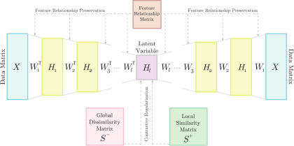

# DANMF_CRFR
## Deep Autoencoder-like NMF with Contrastive Regularization and Feature Relationship preservation
  
  *Seyed Amjad Seyedi, Abdulrahman Lotfi, Parham Moradi, Nooruldeen Nasih Qader*
  
  *Expert Systems with Applications (214) 2023, 119051*
  
  *https://doi.org/10.1016/j.eswa.2022.119051*

  # Abstract

Nonnegative Matrix Factorization is a data analysis method to discover parts-based, linear representations of data. It has been successfully used in a great variety of applications. Deep Nonnegative Matrix Factorization (deep NMF) was recently established to cope with the extraction of hierarchical latent feature representation, and it has been demonstrated to achieve outstanding results in unsupervised representation learning. However, defining a suitable regularization for the deep models is a key challenge, and the existing Deep NMF approaches lack a well-suited regularization. In this paper, we propose the Deep Autoencoder-like NMF with Contrastive Regularization and Feature Relationship preservation (DANMF-CRFR) to address the above problem. Inspired by contrastive learning, this deep model is able to learn discriminative and instructive deep features while adequately enforcing the local and global structures of the data to its decoder and encoder components. Meanwhile, DANMF-CRFR also imposes feature correlations on the basis matrices during feature learning to improve part-based learning capabilities. Multiplicative updating rules and convergence guarantees are also provided. Extensive experimental results demonstrate the advantages of the proposed model. The source code for reproducing our results can be found at https://github.com/NavidSalahian/DANMF_CRFR.
